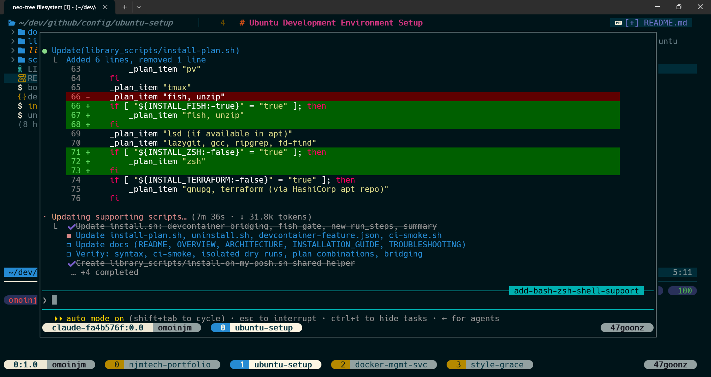

# Ubuntu Development Environment Setup

Automated installation script to set up a complete modern development environment on Ubuntu with modern tools and configurations.



## What Gets Installed

**Core (always installed):**

- **tmux** — Terminal multiplexer for session management
- **bash** — Enhanced automatically (oh-my-posh prompt, `~/.local/bin` on `PATH`, NVM sourcing) since it's already Ubuntu's default shell
- **Neovim** — Modern text editor with common dependencies (ripgrep, fd, lazygit)
- **NVM + Node.js LTS** — Node version manager and latest LTS runtime
- **fzf** — Fuzzy finder with shell integration
- **Nerd Fonts** — Droid Sans Mono Nerd Font for terminal icons
- **Dotfiles** — Personal configuration files from GitHub

**Default-on (toggle off with an environment variable):**

- **Fish shell** — Advanced command-line shell with syntax highlighting and oh-my-posh — `INSTALL_FISH=false ./install.sh` to skip

**Optional (enable with environment variables):**

- **Zsh shell** — `INSTALL_ZSH=true ./install.sh` (oh-my-posh prompt, same as fish/bash)
- **Terraform** — `INSTALL_TERRAFORM=true ./install.sh`
- **Nebius CLI** — `INSTALL_NEBIUS_CLI=true ./install.sh`
- **.NET SDK** — `INSTALL_DOTNET=true ./install.sh`

## Choosing a Shell

Fish, Zsh, and bash are all first-class options — pick whichever combination you want:

- **Do nothing** — you get Fish (default-on) plus bash automatically enhanced with the same oh-my-posh prompt, `~/.local/bin` PATH, and NVM sourcing.
- **Env vars** (direct install or the curl one-liner):

  ```bash
  # Zsh instead of Fish
  INSTALL_FISH=false INSTALL_ZSH=true ./install.sh

  # Both Fish and Zsh installed, pick a default later with chsh
  INSTALL_ZSH=true ./install.sh
  ```

- **Devcontainer feature** — `installFish`/`installZsh` options in `devcontainer-feature.json` map straight to the same flags. This repo isn't published to a feature registry, so reference it directly (e.g. by relative path, if vendored into your own devcontainer setup):

  ```json
  "features": {
    "./path/to/ubuntu-setup": {
      "installFish": false,
      "installZsh": true
    }
  }
  ```

Whichever shell(s) you end up with, `install.sh`'s "Next steps" output prints the right `chsh` command to make it your login shell — bash never needs one, since it's already the OS default.

## Quick Install

Install the latest tagged release with a single command — no manual clone needed:

```bash
curl -fsSL https://raw.githubusercontent.com/omoinjm/ubuntu-setup/main/bootstrap.sh | bash
```

`bootstrap.sh` clones the repo into a temp directory and hands off to `install.sh`, so all the usual flags and env vars work the same way, e.g.:

```bash
curl -fsSL https://raw.githubusercontent.com/omoinjm/ubuntu-setup/main/bootstrap.sh | bash -s -- --show-plan
INSTALL_TERRAFORM=true curl -fsSL https://raw.githubusercontent.com/omoinjm/ubuntu-setup/main/bootstrap.sh | bash
```

Pin a specific version with `UBUNTU_SETUP_VERSION` (defaults to the latest tag, falling back to `main`):

```bash
UBUNTU_SETUP_VERSION=v0.1.0 curl -fsSL https://raw.githubusercontent.com/omoinjm/ubuntu-setup/main/bootstrap.sh | bash
```

## Manual Install

If you'd rather inspect or modify the scripts before running them:

```bash
# Clone the repository
git clone https://github.com/omoinjm/ubuntu-setup.git
cd ubuntu-setup

# Make scripts executable
chmod +x install.sh uninstall.sh library_scripts/*.sh scripts/ci-smoke.sh

# Run the installation
./install.sh

# Preview what will be installed (no changes made)
./install.sh --show-plan

# Optional tools
INSTALL_TERRAFORM=true INSTALL_NEBIUS_CLI=true ./install.sh
```

## Requirements

- **Ubuntu** 18.04 LTS or newer
- **Sudo/root access** for package installation
- **Internet connection** for downloading packages and repositories
- **At least 2GB** of free disk space
- **Git** and **curl** (validated during setup)

## Configuration

Environment variables (see `library_scripts/config.sh`):

| Variable | Default | Description |
|----------|---------|-------------|
| `DOTFILES_REPO` | `https://github.com/omoinjm/.dotfiles.git` | Dotfiles HTTPS URL |
| `DOTFILES_OPTIONAL` | `false` | Continue if dotfiles clone fails |
| `INSTALL_PV` | `true` | Install `pv` for enhanced download progress bars |
| `INSTALL_FISH` | `true` | Install and configure Fish shell |
| `INSTALL_ZSH` | `false` | Install and configure Zsh shell |
| `INSTALL_TERRAFORM` | `false` | Install Terraform |
| `INSTALL_NEBIUS_CLI` | `false` | Install Nebius CLI |
| `INSTALL_DOTNET` | `false` | Install .NET SDK |
| `SHOW_INSTALL_PLAN` | `true` | Print package/step summary before installing |
| `SHOW_INSTALL_COMMANDS` | `true` | Print each shell command as it runs |
| `DISABLE_SPINNER` | `false` | Disable animated progress spinners (auto-disabled in CI) |

## Documentation

For more information, see the [docs/](docs/) folder:

- **[OVERVIEW.md](docs/OVERVIEW.md)** — Project details and features
- **[ARCHITECTURE.md](docs/ARCHITECTURE.md)** — Technical architecture
- **[INSTALLATION_GUIDE.md](docs/INSTALLATION_GUIDE.md)** — Detailed setup instructions
- **[TROUBLESHOOTING.md](docs/TROUBLESHOOTING.md)** — Common issues and solutions
- **[ADDING_MODULES.md](docs/ADDING_MODULES.md)** — How to add new tools
- **[AI_CONTEXT.md](docs/AI_CONTEXT.md)** — Context for AI systems analyzing this code

## What Happens During Installation

1. Validates system prerequisites (OS, sudo, disk, curl)
2. Updates system package repositories and adds PPAs
3. Clones personal dotfiles from GitHub
4. Installs and configures each tool in sequence
5. Verifies installations and prints next steps
6. Writes a log to `~/.ubuntu-setup-install.log`

## Post-Installation Steps

```bash
# Set your preferred shell as default (bash needs no chsh, it's enhanced automatically)
chsh -s /usr/bin/fish   # if INSTALL_FISH=true (default)
chsh -s /usr/bin/zsh    # if INSTALL_ZSH=true

# Logout and login for changes to take effect
```

## Uninstall

```bash
./uninstall.sh
```

## Development / CI

```bash
./scripts/ci-smoke.sh
```

GitHub Actions runs syntax checks, ShellCheck, and structural smoke tests on every push and pull request.

Progress indicators show elapsed time on all spinners. File downloads use `pv` for byte/rate/ETA bars when available (`INSTALL_PV=true` by default, installed automatically if missing). Otherwise downloads fall back to `curl --progress-bar`.

## Troubleshooting

If installation fails, check [docs/TROUBLESHOOTING.md](docs/TROUBLESHOOTING.md) for solutions to common issues.


## About

- [Twitter @njmtech\](https://twitter.com/njmtech)
- [Portfolio](https://njmtech.co.za/)

## License

See [LICENSE](LICENSE) for details.
